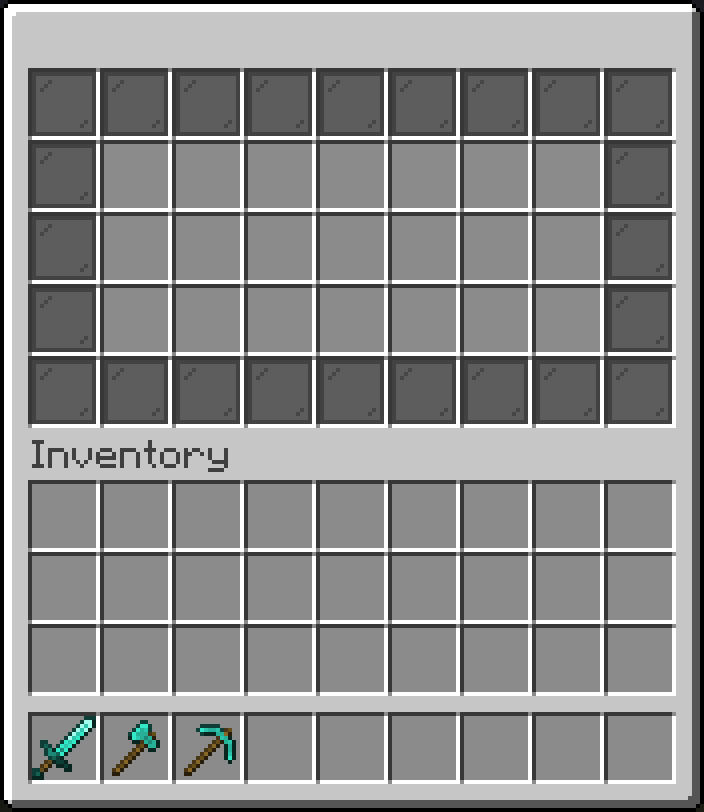
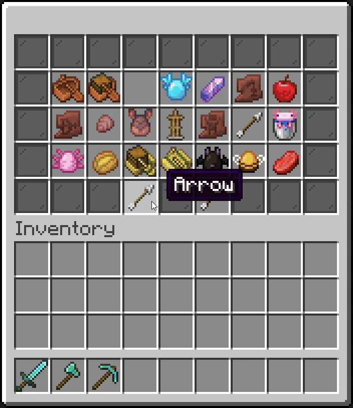

## What is a Gui?

In InvUI, a `Gui` is simply a rectangle of slots. Each slot can either be empty or contain something like an [Item](item.md), a link to another [Gui](gui.md), or a link to an [Inventory](inventory.md).

## Gui Types

### Normal Gui

Using `#!kotlin Gui.builder()`, you can create a very simple Gui without any special functionality. With the gui builder, you can define a structure where each character corresponds to an ingredient, in this case the glass pane item.

```kotlin
val gui: Gui = Gui.builder()
    .setStructure(
        "# # # # # # # # #",
        "# x x x x x x x #",
        "# x x x x x x x #",
        "# x x x x x x x #",
        "# # # # # # # # #",
    )
    .addIngredient('#', Item.simple(ItemBuilder(Material.BLACK_STAINED_GLASS_PANE)))
    .build()
```

{width=500}

### Paged Gui

A `PagedGui` is a specialized gui type that has pages of content. This content can be either [items](item.md), entire [guis](gui.md), or [inventories](inventory.md). The following example will use [items](item.md) as content.

Before creating a `PagedGui`, you must first create the page buttons with which the player is supposed to navigate it. For that, [bound items](item.md#bound-item) are a useful tool. Using `#!kotlin BoundItem.pagedBuilder()`, you can create a builder for a bound item that targets paged guis. This item's `ItemProvider` will also automatically be updated when the current page or total page count changes:

```kotlin
val back: BoundItem = BoundItem.pagedBuilder()
    .setItemProvider(ItemBuilder(Material.ARROW))
    .addClickHandler { _, gui, _ -> gui.page-- }
    .build()

val forward: BoundItem = BoundItem.pagedBuilder()
    .setItemProvider(ItemBuilder(Material.ARROW))
    .addClickHandler { _, gui, _ -> gui.page++ }
    .build()
```

When creating the `PagedGui`, you will need to tell InvUI where to put the page content. This is what `Markers.CONTENT_LIST_SLOT_HORIZONTAL` does. In the following example, the ingredient `x` is marked as a content list slot, i.e. a slot for page content. There is also `Markers.CONTENT_LIST_SLOT_VERTICAL`. The difference between the two is that with the `HORIZONTAL` marker, the slots are filled left-to-right row-by-row, whereas the `VERTICAL` marker orders the items top-down column-by-column.

```kotlin
val allTheItemTypes: List<Item> = Material.entries
    .filter { !it.isLegacy && it.isItem }
    .map { Item.simple(ItemBuilder(it)) }

val gui: PagedGui<Item> = PagedGui.itemsBuilder()
    .setStructure(
        "# # # # # # # # #",
        "# x x x x x x x #",
        "# x x x x x x x #",
        "# x x x x x x x #",
        "# # # < # > # # #",
    )
    .addIngredient('#', Item.simple(ItemBuilder(Material.BLACK_STAINED_GLASS_PANE)))
    .addIngredient('x', Markers.CONTENT_LIST_SLOT_HORIZONTAL)
    .addIngredient('<', back)
    .addIngredient('>', forward)
    .setContent(allTheItemTypes)
    .build()
```

{width=500}

!!! info "`Markers.CONTENT_LIST_SLOT_HORIZONTAL` vs. `Markers.CONTENT_LIST_SLOT_VERTICAL`"
    
    The above example uses `Markers.CONTENT_LIST_SLOT_HORIZONTAL`, but there is also `Markers.CONTENT_LIST_SLOT_VERTICAL`. The difference between the two is that with the `HORIZONTAL` marker, the slots are filled left-to-right row-by-row, whereas the `VERTICAL` marker orders the items top-down column-by-column.

??? example "Example: Page buttons with proper item names"

    The above example omits names from the navigation buttons for simplicity. In real world cases, you will likely want to do something like this:
    
    ```kotlin
    val back: BoundItem = BoundItem.pagedBuilder()
        .setItemProvider { _, gui ->
            if (gui.page > 0) {
                ItemBuilder(Material.ARROW)
                    .setName("<gray>Move to page <aqua>${gui.page}<gray>/<aqua>${gui.pageCount}") // (1)!
            } else {
                // no arrow if we can't go further back
                ItemBuilder(Material.BLACK_STAINED_GLASS_PANE).hideTooltip(true)
            }
        }
        .addClickHandler { _, gui, _ -> gui.page-- }
        .build()
    
    val forward: BoundItem = BoundItem.pagedBuilder()
        .setItemProvider { _, gui ->
            if (gui.page < gui.pageCount - 1) {
                ItemBuilder(Material.ARROW)
                    .setName("<gray>Move to page <aqua>${gui.page + 2}<gray>/<aqua>${gui.pageCount}")
            } else {
                // no arrow if we can't go further
                ItemBuilder(Material.BLACK_STAINED_GLASS_PANE).hideTooltip(true)
            }
        }
        .addClickHandler { _, gui, _ -> gui.page++ }
        .build()
    ```
    
    1. Names in `ItemBuilder` are in [MiniMessage](https://docs.advntr.dev/minimessage/format) format.

    {width=500}

### Scroll Gui

Like paged guis, a `ScrollGui` is also a specialized gui type that can contain [items](item.md), [guis](gui.md), or [inventories](inventory.md). However, instead of pages, content is displayed in lines that can be scrolled through.

Firstly, you will need to create the scroll buttons:

```kotlin
val up: BoundItem = BoundItem.scrollBuilder()
    .setItemProvider(ItemBuilder(Material.ARROW))
    .addClickHandler { _, gui, _ -> gui.line-- }
    .build()

val down: BoundItem = BoundItem.scrollBuilder()
    .setItemProvider(ItemBuilder(Material.ARROW))
    .addClickHandler { _, gui, _ -> gui.line++ }
    .build()
```

Like for paged guis, the content slots can be defined by adding a content list slot marker ingredient:

```kotlin
val allTheItemTypes: List<Item> = Material.entries
    .filter { !it.isLegacy && it.isItem }
    .map { Item.simple(ItemBuilder(it)) }

val gui: ScrollGui<Item> = ScrollGui.itemsBuilder()
    .setStructure(
        "# # x x x x x x #",
        "u # x x x x x x #",
        "# # x x x x x x #",
        "d # x x x x x x #",
        "# # x x x x x x #",
    )
    .addIngredient('#', Item.simple(ItemBuilder(Material.BLACK_STAINED_GLASS_PANE)))
    .addIngredient('x', Markers.CONTENT_LIST_SLOT_HORIZONTAL)
    .addIngredient('u', up)
    .addIngredient('d', down)
    .setContent(allTheItemTypes)
    .build()
```

{width=500}

### Tab Gui

A `TabGui` allows you to define a list of tabs, which themselves are also guis. You can then create tab buttons to switch between them.

First, lets create the tab buttons:

```kotlin
val tab0Btn: BoundItem = BoundItem.tabBuilder()
    .setItemProvider(ItemBuilder(Material.PAPER))
    .addClickHandler { _, gui, _ -> gui.tab = 0 }
    .build()

val tab1Btn: BoundItem = BoundItem.tabBuilder()
    .setItemProvider(ItemBuilder(Material.CHAIN))
    .addClickHandler { _, gui, _ -> gui.tab = 1 }
    .build()
```

Like before, you can define the content list slots for the tab area using a content list slot marker ingredient. In the following example, I have re-used the example paged- and scroll guis from above as tabs (after adjusting them a bit to fit into the dimensions of a tab):

```kotlin
val gui: TabGui = TabGui.builder()
    .setStructure(
        "# # # 0 # 1 # # #",
        "x x x x x x x x x",
        "x x x x x x x x x",
        "x x x x x x x x x",
        "x x x x x x x x x",
    )
    .addIngredient('#', Item.simple(ItemBuilder(Material.BLACK_STAINED_GLASS_PANE)))
    .addIngredient('x', Markers.CONTENT_LIST_SLOT_HORIZONTAL)
    .addIngredient('0', tab0Btn)
    .addIngredient('1', tab1Btn)
    .setTabs(listOf(tab0, tab1))
    .build()
```

{width=500}

??? example "Full code"

    ```kotlin
    val back: BoundItem = BoundItem.pagedBuilder()
        .setItemProvider(ItemBuilder(Material.ARROW))
        .addClickHandler { _, gui, _ -> gui.page-- }
        .build()
    
    val forward: BoundItem = BoundItem.pagedBuilder()
        .setItemProvider(ItemBuilder(Material.ARROW))
        .addClickHandler { _, gui, _ -> gui.page++ }
        .build()
    
    val up: BoundItem = BoundItem.scrollBuilder()
        .setItemProvider(ItemBuilder(Material.ARROW))
        .addClickHandler { _, gui, _ -> gui.line-- }
        .build()
    
    val down: BoundItem = BoundItem.scrollBuilder()
        .setItemProvider(ItemBuilder(Material.ARROW))
        .addClickHandler { _, gui, _ -> gui.line++ }
        .build()
    
    val tab0Btn: BoundItem = BoundItem.tabBuilder()
        .setItemProvider(ItemBuilder(Material.PAPER))
        .addClickHandler { _, gui, _ -> gui.tab = 0 }
        .build()
    
    val tab1Btn: BoundItem = BoundItem.tabBuilder()
        .setItemProvider(ItemBuilder(Material.CHAIN))
        .addClickHandler { _, gui, _ -> gui.tab = 1 }
        .build()
    
    val allTheItemTypes: List<Item> = Material.entries
        .filter { !it.isLegacy && it.isItem }
        .map { Item.simple(ItemBuilder(it)) }
    
    val tab0: PagedGui<Item> = PagedGui.itemsBuilder()
        .setStructure(
            "x x x x x x x x x",
            "x x x x x x x x x",
            "x x x x x x x x x",
            "# # # < # > # # #",
        )
        .addIngredient('#', Item.simple(ItemBuilder(Material.BLACK_STAINED_GLASS_PANE)))
        .addIngredient('x', Markers.CONTENT_LIST_SLOT_HORIZONTAL)
        .addIngredient('<', back)
        .addIngredient('>', forward)
        .setContent(allTheItemTypes)
        .build()
    
    val tab1: ScrollGui<Item> = ScrollGui.itemsBuilder()
        .setStructure(
            "u # x x x x x x #",
            "# # x x x x x x #",
            "# # x x x x x x #",
            "d # x x x x x x #",
        )
        .addIngredient('#', Item.simple(ItemBuilder(Material.BLACK_STAINED_GLASS_PANE)))
        .addIngredient('x', Markers.CONTENT_LIST_SLOT_HORIZONTAL)
        .addIngredient('u', up)
        .addIngredient('d', down)
        .setContent(allTheItemTypes)
        .build()
    
    val gui: TabGui = TabGui.builder()
        .setStructure(
            "# # # 0 # 1 # # #",
            "x x x x x x x x x",
            "x x x x x x x x x",
            "x x x x x x x x x",
            "x x x x x x x x x",
        )
        .addIngredient('#', Item.simple(ItemBuilder(Material.BLACK_STAINED_GLASS_PANE)))
        .addIngredient('x', Markers.CONTENT_LIST_SLOT_HORIZONTAL)
        .addIngredient('0', tab0Btn)
        .addIngredient('1', tab1Btn)
        .setTabs(listOf(tab0, tab1))
        .build()
    ```

### Global Ingredients

Some ingredients, like content list slot markers or navigation buttons, are expected to stay the same across guis. For such cases, it may make sense to register the ingredients globally. Once you have defined a global ingredient, it will be automatically used by all gui builders, without having to manually call `addIngredient` every time.

```kotlin
Structure.addGlobalIngredient('x', Markers.CONTENT_LIST_SLOT_HORIZONTAL)

Structure.addGlobalIngredient(
    '>',
    BoundItem.pagedBuilder()
        .setItemProvider(ItemBuilder(Material.ARROW))
        .addClickHandler { _, gui, _ -> gui.page++ }
)

Structure.addGlobalIngredient(
    '<',
    BoundItem.pagedBuilder()
        .setItemProvider(ItemBuilder(Material.ARROW))
        .addClickHandler { _, gui, _ -> gui.page-- }
)
```

## Ingredient Preset

Instead of defining global ingredients, you can also create ingredient presets which you can then apply whenever needed:

```kotlin
val preset: IngredientPreset = IngredientPreset.builder()
    .addIngredient(
        '>',
        BoundItem.pagedBuilder()
            .setItemProvider(ItemBuilder(Material.ARROW))
            .addClickHandler { _, gui, _ -> gui.page++ }
    )
    .addIngredient(
        '<',
        BoundItem.pagedBuilder()
            .setItemProvider(ItemBuilder(Material.ARROW))
            .addClickHandler { _, gui, _ -> gui.page-- }
    )
    .build()

val gui: Gui = Gui.builder()
    .setStructure(/* ... */)
    .applyPreset(preset)
    .build()
```

## Animations

An animation lets slots of a gui pop in, in a specific order with a specific delay.

Animations consist of the following five components:

1. Slot filter: Defines which slots are part of the animation.
2. Slot selector: Selects the slots that are shown in each frame.
3. Intermediary generator: Creates intermediary items that are displayed before the slots pop in. (air by default)
4. Show handler: Called when slot(s) are shown, for example to play a sound effect.
5. Finish handler: Called when the animation is finished.

There are various built-in slot selectors available. In the following example, I chose `horizontalSnake` and added a filter that looks for slots of ingredient `#`. This means that only those slots will pop in, whereas all other slots will already be visible when the animation starts.

```kotlin
val animation = Animation.builder()
    .setSlotSelector(Animation::horizontalSnakeSlotSelector)
    .filterTaggedSlots('x') // specialized filter that looks for slots of ingredient 'x'
    .build()
```

To start an animation, call `#!kotlin Gui.playAnimation(animation)`.

{width=500}

??? example "Example: Playing animations on window open"

    There is no direct way to play animations on gui-open, because guis do not have awareness of "being opened". Instead, it is the window which is opened, and the gui is just embedded in the window. Additionally, it also doesn't make sense to share such guis between players, because only one of them will be the one opening the window. With a shared gui however, both would see the animation. This is why a separate gui instance per window is needed.

    If you configure your window and gui builders in a certain way, you can ensure separate gui instances per player and trigger a call to `playAnimation` automatically:

    ```kotlin
    val windowBuilder: Window.Builder<*, *> = Window.builder()
        .setUpperGui(PagedGui.itemsBuilder()
            .setStructure(
                "# # # # # # # # #",
                "# x x x x x x x #",
                "# x x x x x x x #",
                "# x x x x x x x #",
                "# # # < # > # # #",
            )
            .addIngredient('#', Item.simple(ItemBuilder(Material.BLACK_STAINED_GLASS_PANE).hideTooltip(true)))
            .addIngredient('x', Markers.CONTENT_LIST_SLOT_HORIZONTAL)
            .addIngredient('<', back)
            .addIngredient('>', forward)
            .setContent(allTheItemTypes)
            .addModifier { it.playAnimation(animation) } // (1)!
            // no .build()
        )
    
    windowBuilder.open(player) // builds gui and window for player, then opens window
    
    // ... later:
    windowBuilder.open(otherPlayer) // builds gui and window for otherPlayer, then opens window
    ```
    
    1. A modifier is a lambda that is run when the gui is built. Note that this code omits the `.build()` at the end of the gui builder chain. This causes the window builder to build a new gui for each window. Since we only use `windowBuilder.open`, building a window also means opening it. This means our modifier with `playAnimation` is called every time the window is opened.

??? example "Example: Playing animations for page switching"

    The following example uses the page buttons to start playing the animation, but you can just as well start the animation in the page change handler of the `PagedGui`.

    ```kotlin
    val animation = Animation.builder()
        .setSlotSelector(Animation::horizontalSnakeSlotSelector)
        .filterTaggedSlots('x')
        .setFreezing(false) // (1)!
        .build()
    
    val back: BoundItem = BoundItem.pagedBuilder()
        .setItemProvider(ItemBuilder(Material.ARROW))
        .addClickHandler { _, gui, _ ->
            gui.cancelAnimation()
            gui.page--
            gui.playAnimation(animation)
        }
        .build()
    
    val forward: BoundItem = BoundItem.pagedBuilder()
        .setItemProvider(ItemBuilder(Material.ARROW))
        .addClickHandler { _, gui, _ ->
            gui.cancelAnimation()
            gui.page++
            gui.playAnimation(animation)
        }
        .build()
    
    val allTheItemTypes: List<Item> = Material.entries
        .filter { !it.isLegacy && it.isItem }
        .map { Item.simple(ItemBuilder(it)) }
    
    val gui: PagedGui<Item> = PagedGui.itemsBuilder()
        .setStructure(
            "# # # # # # # # #",
            "# x x x x x x x #",
            "# x x x x x x x #",
            "# x x x x x x x #",
            "# # # < # > # # #",
        )
        .addIngredient('#', Item.simple(ItemBuilder(Material.BLACK_STAINED_GLASS_PANE)))
        .addIngredient('x', Markers.CONTENT_LIST_SLOT_HORIZONTAL)
        .addIngredient('<', back)
        .addIngredient('>', forward)
        .setContent(allTheItemTypes)
        .build()
    ```
    
    1. By default, animations freeze the gui while they are running. This means that the player cannot interact with the gui until the animation is finished. Disabling freezing allows the user to switch to the next page before the animation finished playing.
    
    {width=500}