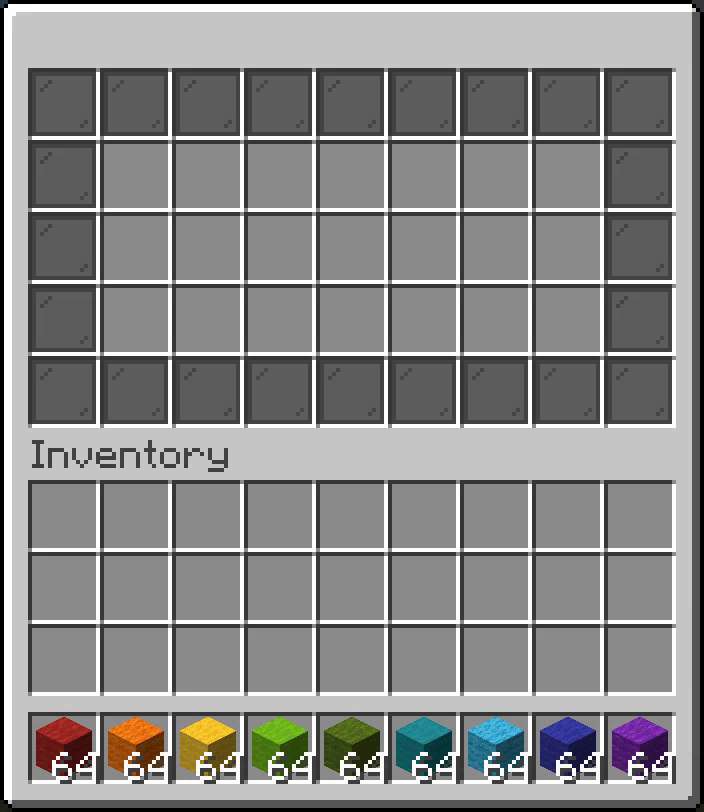
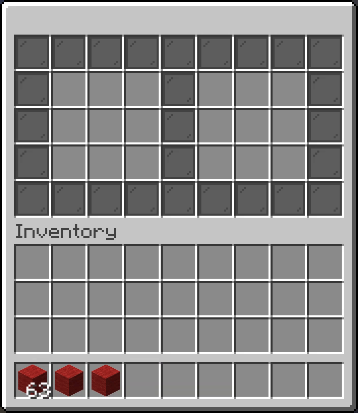
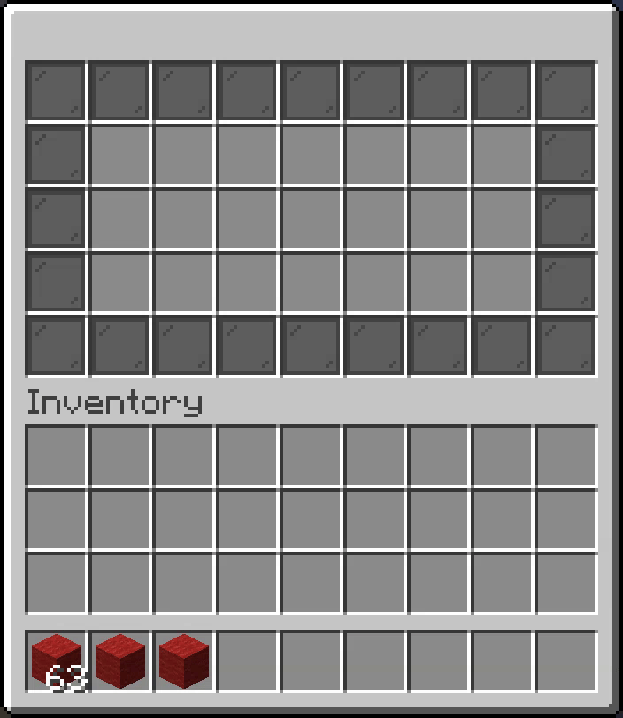
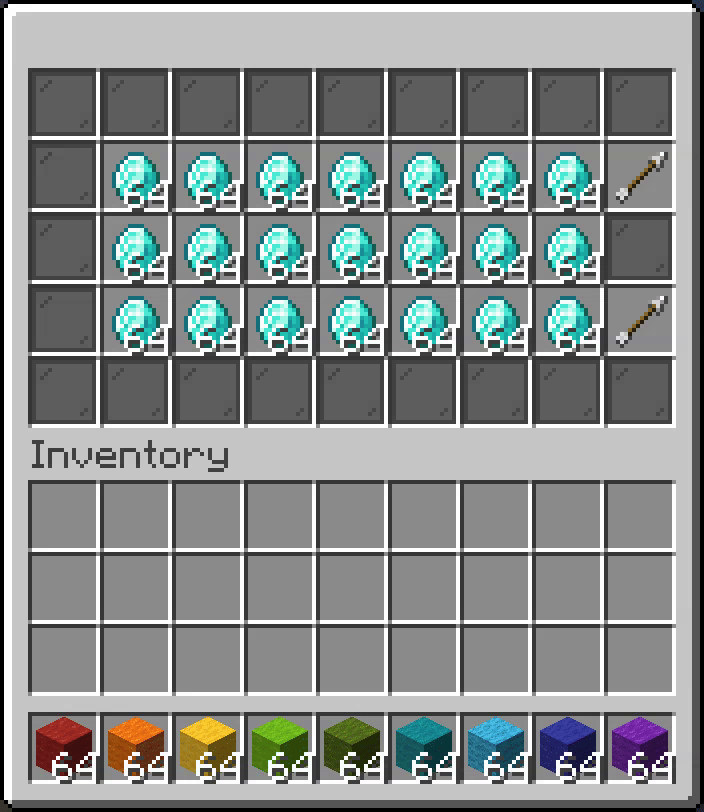

## What is an Inventory?

InvUI has its own inventories, not to be confused with `org.bukkit.inventory.Inventory`. InvUI's inventories can be embedded in guis, which will allow players to interact with these slots.

## Virtual Inventory

For most use cases, you will want to use a `VirtualInventory`. This is just a container for item stacks that you can add to your guis like so:

=== "Kotlin"
    ```kotlin
    val inv = VirtualInventory(7 * 4)
    val gui = Gui.builder()
        .setStructure(
            "# # # # # # # # #",
            "# x x x x x x x #",
            "# x x x x x x x #",
            "# x x x x x x x #",
            "# # # # # # # # #",
        )
        .addIngredient('x', inv)
        .build()
    ```

=== "Java"
    ```java
    var inv = new VirtualInventory(7 * 4);
    var gui = Gui.builder()
        .setStructure(
            "# # # # # # # # #",
            "# x x x x x x x #",
            "# x x x x x x x #",
            "# x x x x x x x #",
            "# # # # # # # # #"
        )
        .addIngredient('x', inv)
        .build();
    ```

{width=500}

### Inventory Events

InvUI's inventories have a powerful event system. There are multiple events that you can listen to, each of which is fired at a different stage of the interaction and can be used for different purposes. `ItemPreUpdateEvent` and `ItemPostUpdateEvent` are fired with an `UpdateReason`. If a player interaction caused the event, this will be a `PlayerUpdateReason` from which you can retrieve the player and additional information about the click.

#### ItemPreUpdateEvent

This event is called before changes were fully processed. Cancelling this event or changing the amount of items that were added or removed will affect the source of the change (i.e. the player's cursor most of the time) appropriately, if possible. This allows restricting which or how many items can be put into an inventory or even a specific slot of an inventory.

In the following example, the `ItemPreUpdateEvent` is cancelled or handled in such a way that only red and orange wool can be put into the inventory. Additionally, orange wool can no longer be stacked:

=== "Kotlin"
    ```kotlin
    inv.addPreUpdateHandler { event ->
        if (event.isAdd || event.isSwap) {
            when (event.newItem?.type) {
                Material.RED_WOOL -> Unit // red wool can be added normally
                Material.ORANGE_WOOL -> event.newItem?.amount = 1 // orange wool stack size is limited to 1
                else -> event.isCancelled = true // cancel event for all other item types
            }
        }
    }
    ```

=== "Java"
    ```java
    inv.addPreUpdateHandler(event -> {
        if (event.isAdd() || event.isSwap()) {
            switch (event.getNewItem().getType()) {
                case Material.RED_WOOL -> {} // red wool can be added normally
                case Material.ORANGE_WOOL -> event.getNewItem().setAmount(1); // orange wool stack size is limited to 1
                default -> event.setCancelled(true); // cancel event for all other item types
            }
        }
    });
    ```

{width=500}


#### ItemPostUpdateEvent

This event is called after changes were performed on a slot. It is not cancellable and changes done to the inventory during this event will not affect the source of the change.

In the following example, the `ItemPostUpdateEvent` is used to implement a trash can menu:

=== "Kotlin"
    ```kotlin
    inv.addPostUpdateHandler { event -> 
        event.inventory.setItem(UpdateReason.SUPPRESSED, 0, null) // (1)!
    }
    ```

    1. `UpdateReason.SUPPRESSED` prevents events from firing. Otherwise, this would cause an infinite loop.

=== "Java"
    ```java
    inv.addPostUpdateHandler(event -> {
        event.getInventory().setItem(UpdateReason.SUPPRESSED, 0, null); // (1)!
    });
    ```

    1. `UpdateReason.SUPPRESSED` prevents events from firing. Otherwise, this would cause an infinite loop.

{width=500}

#### InventoryClickEvent

InvUI also has its own inventory click event, not to be confused with `org.bukkit.event.inventory.InventoryClickEvent`. This event is fired when a player clicks on a slot in a gui-embedded inventory. For most cases, `ItemPreUpdateEvent` and `ItemPostUpdateEvent` are sufficient. However, in very specialized cases, you might want to intercept certain click actions and use them for something else.

In the following example, the `InventoryClickEvent` is used to change the number key presses from moving the item to the hotbar slots to changing their amount instead:

=== "Kotlin"
    ```kotlin
    inv.addClickHandler { event ->
        if (event.clickType == ClickType.NUMBER_KEY) {
            event.isCancelled = true
            val newItem = event.inventory.getItem(event.slot)?.apply { amount = event.hotbarButton + 1 }
            event.inventory.setItem(null, event.slot, newItem)
        }
    }
    ```

=== "Java"
    ```java
    inv.addClickHandler(event -> {
        if (event.getClickType() == ClickType.NUMBER_KEY) {
            event.setCancelled(true);
            var newItem = event.getInventory().getItem(event.getSlot());
            if (newItem != null)
                newItem.setAmount(event.getHotbarButton() + 1);
            event.getInventory().setItem(null, event.getSlot(), newItem);
        }
    });
    ```

{width=500}

### Serialization

You can also serialize and deserialize `VirtualInventory` (i.e. saving and loading it):

Serializing a `VirtualInventory`:
=== "Kotlin"
    ```kotlin
    // serialize a VirtualInventory to a ByteArray
    val bin: ByteArray = virtualInventory.serialize()
    
    // write a VirtualInventory directly to an output stream
    file.outputStream().use { virtualInventory.serialize(it) }
    ```

=== "Java"
    ```java
    // serialize a VirtualInventory to a ByteArray
    byte[] bin = virtualInventory.serialize();
    
    // write a VirtualInventory directly to an output stream    
    try (var out = new FileOutputStream(file)) {
        virtualInventory.serialize(out);
    }
    ```

Deserializing a `VirtualInventory`:
=== "Kotlin"
    ```kotlin
    // deserialize a VirtualInventory from a ByteArray
    val inv: VirtualInventory = VirtualInventory.deserialize(bin)
    
    // read a VirtualInventory directly from an input stream
    val inv2: VirtualInventory = file.inputStream().use { VirtualInventory.deserialize(it) }
    ```

=== "Java"
    ```java
    // deserialize a VirtualInventory from a ByteArray
    VirtualInventory inv = VirtualInventory.deserialize(bin);
    
    // read a VirtualInventory directly from an input stream
    VirtualInventory inv2;
    try (var in = new FileInputStream(file)) {
        inv2 = VirtualInventory.deserialize(in);
    }
    ```

There is also `VirtualInventoryManager`, which automatically writes virtual inventories registered with it to disk on shutdown and reads them back on startup. This allows you to very easily create persistent inventories, but note that using `VirtualInventoryManager` with a large amount of inventories will cause a slowdown on startup as all inventories are loaded on startup at once.

=== "Kotlin"
    ```kotlin
    val inv: VirtualInventory = VirtualInventoryManager.getInstance().getOrCreate(uuid, size)
    ```

=== "Java"
    ```java
    VirtualInventory inv = VirtualInventoryManager.getInstance().getOrCreate(uuid, size);
    ```

## Referencing Inventory

The `ReferencingInventory` can be used to reference a Bukkit inventory, such as the player's inventory. For example, you can easily implement a gui to look at another player's inventory using it:

=== "Kotlin"
    ```kotlin
    val inv = ReferencingInventory.fromPlayerStorageContents(otherPlayer.inventory)
    Window.builder()
        .setUpperGui(Gui.of(9, 4, inv))
        .open(player)
    ```

=== "Java"
    ```java
    var inv = ReferencingInventory.fromPlayerStorageContents(otherPlayer.getInventory());
    Window.builder()
        .setUpperGui(Gui.of(9, 4, inv))
        .open(player);
    ```


## Other configuration options

### Gui priority

The gui priority defines the order in which inventories of a gui are iterated over for actions like shift-clicking items or collecting them to the cursor with a double click. Gui priority is categorized, so you can define different priorities per category.

In the following example, the gui priorities are configured in such a way that items are shift-clicked into the right inventory first, but collecting to the cursor prioritizes the left inventory:

=== "Kotlin"
    ```kotlin
    val left = VirtualInventory(9)
    left.setGuiPriority(OperationCategory.ADD, -1)
    left.setGuiPriority(OperationCategory.COLLECT, 1)
    
    val right = VirtualInventory(9)
    
    val gui = Gui.builder()
        .setStructure(
            "# # # # # # # # #",
            "# x x x # y y y #",
            "# x x x # y y y #",
            "# x x x # y y y #",
            "# # # # # # # # #",
        )
        .addIngredient('x', left)
        .addIngredient('y', right)
        .build()
    ```
    
=== "Java"
    ```java
    var left = new VirtualInventory(9);
    left.setGuiPriority(OperationCategory.ADD, -1);
    left.setGuiPriority(OperationCategory.COLLECT, 1);
    
    var right = new VirtualInventory(9)
    
    var gui = Gui.builder()
        .setStructure(
            "# # # # # # # # #",
            "# x x x # y y y #",
            "# x x x # y y y #",
            "# x x x # y y y #",
            "# # # # # # # # #"
        )
        .addIngredient('x', left)
        .addIngredient('y', right)
        .build();
    ```

{width=500}

### Iteration order

The iteration order defines in which order the slots of multi-slot operations like adding or collecting are chosen. By default, the iteration order is from first to the last slot (i.e. items are added into the first available slot and collected from the first matching slot). Like the gui priority, the iteration order is categorized, so you can define different orders per category.

You can change the iteration to a completely custom sequence of slots, but there are also utilities to just reverse it. The following example reverses the iteration order for adding items, but keeps the iteration order for collection items:

=== "Kotlin"
    ```kotlin 
    val inv = VirtualInventory(7 * 4)
    inv.reverseIterationOrder(OperationCategory.ADD)
    
    val gui = Gui.builder()
        .setStructure(
            "# # # # # # # # #",
            "# x x x x x x x #",
            "# x x x x x x x #",
            "# x x x x x x x #",
            "# # # # # # # # #",
        )
        .addIngredient('#', Item.simple(ItemBuilder(Material.BLACK_STAINED_GLASS_PANE).hideTooltip(true)))
        .addIngredient('x', inv)
        .build()
    ```

=== "Java"
    ```java
    var inv = new VirtualInventory(7 * 4);
    inv.reverseIterationOrder(OperationCategory.ADD);
    
    var gui = Gui.builder()
        .setStructure(
            "# # # # # # # # #",
            "# x x x x x x x #",
            "# x x x x x x x #",
            "# x x x x x x x #",
            "# # # # # # # # #"
        )
        .addIngredient('#', Item.simple(new ItemBuilder(Material.BLACK_STAINED_GLASS_PANE).hideTooltip(true)))
        .addIngredient('x', inv)
        .build();
    ```

{width=500}

### Background

The slots in your inventory may be empty, but this does not mean that they have to be visually empty as well. You can set a background `ItemProvider` for your inventory, which will be used to display empty slots. Inventory interactions will keep working as if the slots were empty.

=== "Kotlin"
    ```kotlin
    val inv = VirtualInventory(7 * 4)
    val gui = Gui.builder()
        .setStructure(
            "# # # # # # # # #",
            "# x x x x x x x #",
            "# x x x x x x x #",
            "# x x x x x x x #",
            "# # # # # # # # #",
        )
        .addIngredient('x', inv, ItemBuilder(Material.WHITE_STAINED_GLASS_PANE).hideTooltip(true))
        .build()
    ```

=== "Java"
    ```java
    var inv = new VirtualInventory(7 * 4);
    var gui = Gui.builder()
        .setStructure(
            "# # # # # # # # #",
            "# x x x x x x x #",
            "# x x x x x x x #",
            "# x x x x x x x #",
            "# # # # # # # # #"
        )
        .addIngredient('x', inv, new ItemBuilder(Material.WHITE_STAINED_GLASS_PANE).hideTooltip(true))
        .build();
    ```

{width=500}

!!! warning "Item dragging does not work on slots with a background."

### Obscured slots

By default, multi-slot operations like shift-clicking into or collecting from inventories that are embedded in guis will ignore all slots that are not visible, even if the inventory has more slots. You can change this behavior by setting `Gui.setIgnoreObscuredInventorySlots(false)`:

The following example uses a [scroll gui](gui.md#scroll-gui) to display a large inventory that does not fit on one screen. By default, shift-clicking does nothing if there are no empty visible slots, but with `setIgnoreObscuredInventorySlots(false)`, this is not the case:

=== "Kotlin"
    ```kotlin
    val inv = VirtualInventory(7 * 6)
    repeat(7 * 3) { inv.addItem(null, ItemStack.of(Material.DIAMOND, 64)) }
    
    val gui = ScrollGui.inventoriesBuilder()
        .setStructure(
            "# # # # # # # # #",
            "# x x x x x x x u",
            "# x x x x x x x #",
            "# x x x x x x x d",
            "# # # # # # # # #",
        )
        .setContent(listOf(inv))
        .setIgnoreObscuredInventorySlots(false)
        .build()
    ```

=== "Java"
    ```java
    var inv = new VirtualInventory(7 * 6);
    for (int i = 0; i < 7 * 3; i++) {
        inv.addItem(null, ItemStack.of(Material.DIAMOND, 64));
    }
    
    var gui = ScrollGui.inventoriesBuilder()
        .setStructure(
            "# # # # # # # # #",
            "# x x x x x x x u",
            "# x x x x x x x #",
            "# x x x x x x x d",
            "# # # # # # # # #"
        )
        .setContent(List.of(inv))
        .setIgnoreObscuredInventorySlots(false)
        .build();
    ```

{width=500}