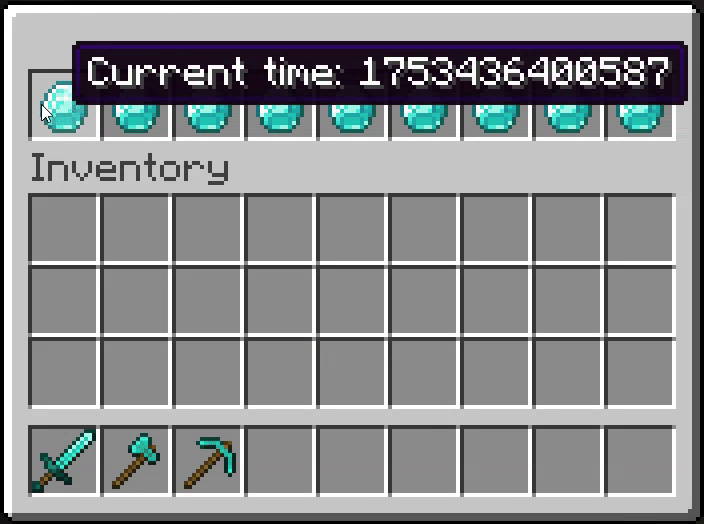
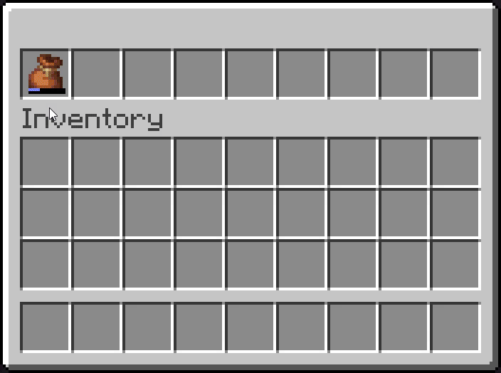

# Item

## What is an Item?

InvUI's UI elements are called `Item`. You can think of an `Item` as a button, though not every `Item` needs to do something when clicked.
An `Item` consists of the following components:

* `ItemProvider`: This is the visual representation of the `Item`, i.e. an `ItemStack`. `ItemProvider` also allows for easy localization. InvUI's built-in `ItemBuilder` is an `ItemProvider`, but you can also just wrap any `ItemStack` using `ItemWrapper`.
* Click handler(s): Click handlers are code that runs when a player clicks on the item. An item can also have no click handlers, i.e. nothing happens and the item remains where it was. (and will not be picked up!)

You can create a very simple item like this:

=== "Kotlin"
    ```kotlin
    val item = Item.builder()
        .setItemProvider(ItemBuilder(Material.DIAMOND)) // the item is represented by a diamond
        .addClickHandler { item, click -> println("Hello World!") } // "Hello World" is printed to the console on click
        .build()
    ```

=== "Java"
    ```java
    Item item = Item.builder()
        .setItemProvider(new ItemBuilder(Material.DIAMOND)) // the item is represented by a diamond
        .addClickHandler(click -> System.out.println("Hello World!")) // "Hello World" is printed to the console on click
        .build();
    ```

For purely decorative items, you can use `#!kotlin Item.simple`:

=== "Kotlin"
    ```kotlin
    val item = Item.simple(ItemBuilder(Material.DIAMOND))
    ```

=== "Java"
    ```java
    Item item = Item.simple(new ItemBuilder(Material.DIAMOND));
    ```

## Updating Items

Of course, in a real-world scenario, you'll want to update the visual representation of the item dynamically. To do that, first define an item provider lambda instead of a constant item provider. However, that alone will not automatically update your item. To trigger an update, which calls your item provider lambda and refreshes the displayed `ItemStack`, you will need to call `#!kotlin Item.notifyWindows()`:

=== "Kotlin"
    ```kotlin
    var count = 0
    val item: Item = Item.builder()
        .setItemProvider { ItemBuilder(Material.DIAMOND).setName("Click count: $count") }
        .addClickHandler { item, click ->
            count++
            item.notifyWindows()
        }.build()
    ```

=== "Java"
    ```java
    AtomicInteger count = new AtomicInteger(0); // (1)!
    Item item = Item.builder()
        .setItemProvider(player -> new ItemBuilder(Material.DIAMOND).setName("Click count: " + count.get()))
        .addClickHandler((it, click) -> {
            count.incrementAndGet();
            it.notifyWindows();
        })
        .build();
    ```
    
    1. Uses `AtomicInteger` because Java lambdas capture by value (requires final or effectively final variables). Alternatively, you may want to store the state in the field of a class.


This can be simplified using `updateOnClick`:

=== "Kotlin"
    ```kotlin
    var count = 0
    val item: Item = Item.builder()
        .setItemProvider { ItemBuilder(Material.DIAMOND).setName("Click count: $count") }
        .addClickHandler { _, click -> count++ }
        .updateOnClick()
        .build()
    ```

=== "Java"
    ```java        
    AtomicInteger count = new AtomicInteger(0);
    Item item = Item.builder()
        .setItemProvider(p -> new ItemBuilder(Material.DIAMOND).setName("Click count: " + count.get()))
        .addClickHandler((it, click) -> count.incrementAndGet())
        .updateOnClick()
        .build();
    ```

{width=500}

In certain scenarios, it may make sense to update your item based on a timer:

=== "Kotlin"
    ```kotlin
    val item: Item = Item.builder()
        .setItemProvider { ItemBuilder(Material.DIAMOND).setName("Current time: ${System.currentTimeMillis()}") }
        .updatePeriodically(1) // Updates the item provider every tick
        .build()
    ```

=== "Java"
    ```java
    Item item = Item.builder()
        .setItemProvider(player -> new ItemBuilder(Material.DIAMOND).setName("Current time: ${System.currentTimeMillis()}"))
        .updatePeriodically(1) // Updates the item provider every tick
        .build();
    ```

{width=500}

There are also various methods available on gui-level that allow mass-updating multiple items at the same time. 

!!! tip "If you're using `invui-kotlin`, the best way is to handle item updating is to use the [declarative gui](declarative-menus.md) design approach."

## Bundle selection

Minecraft's bundle item adds unique inventory interactions to the game. You can also use bundles in InvUI. Simply register a bundle selection handler via `addBundleSelectHandler`:

=== "Kotlin"
    ```kotlin
    val bundleItem: Item = Item.builder()
        .setItemProvider(
            ItemBuilder(Material.BUNDLE).set(
                DataComponentTypes.BUNDLE_CONTENTS,
                BundleContents.bundleContents().addAll(/* ... */).build()
            )
        )
        .addBundleSelectHandler { println("Slot selected: $it") }
        .build()
    ```

=== "Java"
    ```java
    Item bundleItem = Item.builder()
        .setItemProvider(
            new ItemBuilder(Material.BUNDLE).set(
                DataComponentTypes.BUNDLE_CONTENTS,
                BundleContents.bundleContents().addAll(/* ... */).build()
            )
        )
        .addBundleSelectHandler(selectedSlot -> System.out.println("Slot selected: " + selectedSlot))
        .build();
    ```

??? example "Example: Menu with bundle select handler"

    === "Kotlin"
        ```kotlin
        val wools: List<ItemStack> = Tag.WOOL.values.map(ItemStack::of)
        
        var selectedWool: Int = -1
        val display: Item = Item.builder()
            .setItemProvider { wools.getOrNull(selectedWool)?.let(::ItemBuilder) ?: ItemProvider.EMPTY }
            .build()
        
        val bundleItem: Item = Item.builder()
            .setItemProvider(
                ItemBuilder(Material.BUNDLE).set(
                    DataComponentTypes.BUNDLE_CONTENTS,
                    BundleContents.bundleContents().addAll(wools).build()
                )
            )
            .addBundleSelectHandler { selectedSlot ->
                selectedWool = selectedSlot
                display.notifyWindows()
            }
            .build()
        
        Window.builder()
            .setUpperGui(Gui.builder()
                .setStructure("b # # # # # # # #")
                .addIngredient('b', bundleItem)
                .addIngredient('#', display)
            )
            .setLowerGui(Gui.of(9, 4, display))
            .open(player)
        ```

    === "Java"
        ```java
        List<ItemStack> wools = Tag.WOOL.getValues().stream().map(ItemStack::of).toList();
        
        AtomicInteger selectedWool = new AtomicInteger(-1);
        Item display = Item.builder()
            .setItemProvider(p -> {
                if (selectedWool.get() >= 0 && selectedWool.get() < wools.size()) {
                    return new ItemWrapper(wools.get(selectedWool.get()));
                } else {
                    return ItemProvider.EMPTY;
                }
            })
            .build();
        
        Item bundleItem = Item.builder()
            .setItemProvider(
                new ItemBuilder(Material.BUNDLE).set(
                    DataComponentTypes.BUNDLE_CONTENTS,
                    BundleContents.bundleContents().addAll(wools).build()
                )
            )
            .addBundleSelectHandler(selectedSlot -> {
                selectedWool.set(selectedSlot);
                display.notifyWindows();
            })
            .build();
        
        Window.builder()
            .setUpperGui(Gui.builder()
                .setStructure("b # # # # # # # #")
                .addIngredient('b', bundleItem)
                .addIngredient('#', display)
            )
            .setLowerGui(Gui.of(9, 4, display))
            .open(player);
        ```
    
    {width=500}

## Bound Item

Normal items have no awareness of which `Gui` they are a part of. However, sometimes the item is supposed to display the state of a gui or interact with it in some other way. A concrete example for this would be page buttons in a `PagedGui`. They need to call methods on `PagedGui` in order to switch to the next page.
This is where bound items come in: This special item type remembers the first `Gui` it is added to (it is "bound" to that gui) and passes this information on to the click handler.

When a gui is bound, a bind handler is called. This can be used to, for example, register handlers on the gui which refresh the item on certain actions (like page changes). You will likely not need to register bind handlers yourself, as pre-made bound items exist for all gui types and already do this for you.

=== "Kotlin"
    ```kotlin
    val boundItem: BoundItem = BoundItem.builder()
        .addBindHandler { item, gui -> /* ... */ }
        .addClickHandler { item, gui, click -> /* ... */ }
        .build()    
    ```

=== "Java"
    ```java
    BoundItem boundItem = BoundItem.builder()
        .addBindHandler((item, gui) -> { /* ... */ })
        .addClickHandler((item, gui, click) -> { /* ... */})
        .build();
    ```

The topic of bound items will be covered again in the [gui](gui.md) section where needed. 

!!! bug "Re-using bound item instances"

    Note that bound items are bound to the **first** gui they are added to. This means that you cannot re-use the same `BoundItem` instance across multiple guis. If you're registering bound items as global ingredients or in ingredient presets, make sure to pass the `BoundItem.Builder` and not a concrete `BoundItem` instance:

    === "Kotlin"
        ```kotlin
        val boundItemBuilder = BoundItem.builder()
            /* ... */
        
        // DO NOT DO THIS
        // 'x' will always be the same BoundItem instance
        Structure.addGlobalIngredient('x', boundItemBuilder.build())
        
        // DO THIS INSTEAD
        // 'x' will be a new BoundItem instance, built from boundItemBuilder, every time
        Structure.addGlobalIngredient('x', boundItemBuilder)
        ```

    === "Java"
        ```java
        BoundItem.Builder boundItemBuilder = BoundItem.builder()
            /* ... */

        // DO NOT DO THIS
        // 'x' will always be the same BoundItem instance
        Structure.addGlobalIngredient('x', boundItemBuilder.build());

        // DO THIS INSTEAD
        // 'x' will be a new BoundItem instance, built from boundItemBuilder, every time
        Structure.addGlobalIngredient('x', boundItemBuilder);
        ```