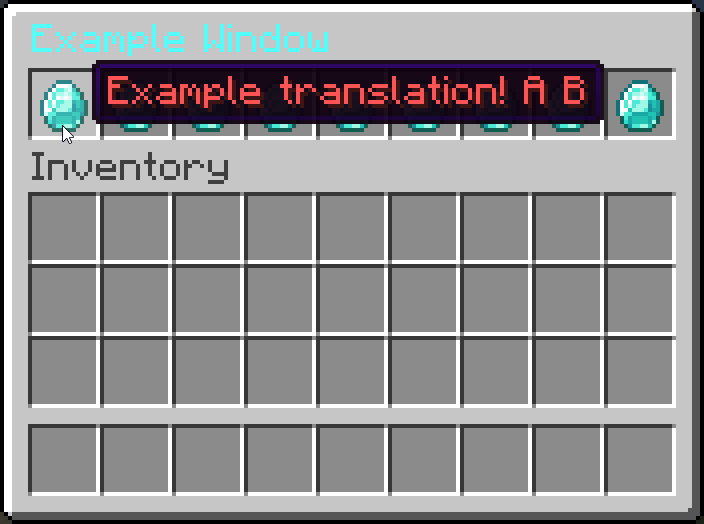

# Localization

## Adding translations

To add translations for a new language, you can call `#!java Languages.getInstance().addLanguage(Locale locale, Map<String, String> translations)`.  The `lang` parameter is the language code of the language you want to add. The `translations` parameter should be a map containing the translation keys and their translations.

If your translations are stored in a json structure like this:

```json title="en_us.json"
{
  "translation.key": "Hello World",
  "other.translation.key": "Hello World 2"
}
```

These translations are interpreted as [MiniMessage](https://docs.advntr.dev/minimessage/index.html) strings. Argument placeholders in translations are defined using `<arg:index>` or with custom names like `<name>`, as explained on the [MiniMessage Translator](https://docs.advntr.dev/minimessage/translator.html#using-a-minimessage-translator) page.

You can also load them using `Languages#loadLanguage`:

=== "Kotlin"

    ```kotlin
    Languages.getInstance().loadLanguage("en_us", File("en_us.json"), Charsets.UTF_8)
    ```

=== "Java"

    ```java
    Languages.getInstance().loadLanguage("en_us", new File("en_us.json"), StandardCharsets.UTF_8);
    ```

## Specifying player language

By default, the player's locale is retrieved using `#!java Player.locale()`. If you want to change this behavior, you can do so by calling `Languages#setLocaleProvider`:

=== "Kotlin"

    ```kotlin
    Languages.getInstance().setLocaleProvider(Player::locale)
    ```

=== "Java"

    ```java
    Languages.getInstance().setLocaleProvider(Player::locale);
    ```

## Using translations

To use translations in your menus, simply use `TranslatableComponent`:

```kotlin
Languages.getInstance().addLanguage(Locale.US, mapOf(
    "invui.example_window.title" to "<aqua>Example Window",
    "invui.example_window.btn.name" to "<red>Example translation! <arg:0> <placeholder>"
))

val itemBuilder = ItemBuilder(Material.DIAMOND)
    .setName(Component.translatable("invui.example_window.btn.name", Component.text("A"))) // (1)!
    .setPlaceholder("placeholder", Component.text("B")) // (2)!

Window.builder()
    .setUpperGui(Gui.of(9, 1, Item.simple(itemBuilder)))
    .setTitle(Component.translatable("invui.example_window.title"))
    .open(player)
```

1. You can pass the arguments directly using the translatable component, as explained [here](https://docs.advntr.dev/minimessage/translator.html#using-a-minimessage-translator).
2. Alternatively, you can also use the ItemBuilder's placeholder system. This fills in placeholders across all components, i.e. the name and lore of the item.

{width=500}

!!! question "When are translations applied?"

    Translations are applied server-side. This is done during `#!java ItemBuilder.build()` or, for the inventory title, `#!java Window.open()`. If you need to use server-side translations in other places, you'll need to manually call `#!java Languages.localized(Locale locale, Component component)`.

## Disabling server-side translations

If you do not want your items and window titles to be translated server-side and instead want to send translatable components to your players, you can disable server-side translations by calling `#!java Languages.getInstance().enableServerSideTranslations(false)`.