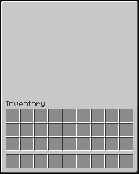
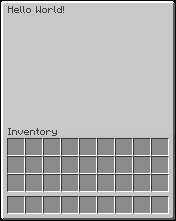
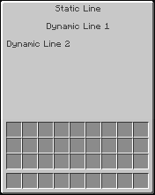

# GUI Textures

## What are GUI Textures?

A `GuiTexture` is an image of a GUI that is laid over an actual, invisible, inventory (e.g. chest, anvil, etc.):

{style="width:50%;image-rendering:pixelated;image-rendering:crisp-edges"}

The `GuiTexture` is actually a large [custom font character](../fonts/fonts.md) that is added to the inventory's title. Nova's resource pack makes most inventories (like chests, anvil, etc.) invisible and also injects a GUI texture for them. That's why custom GUI textures look like they replace the inventory's texture, when in reality, it's just an overlay. The underlying arrangement of the slots is still the same, so you need to align your GUI texture accordingly.

## Creating and using GUI Textures

!!! tip "Nova uses InvUI for GUIs. Check out InvUI's documentation [here](../../../../invui/)."

This is how you create a simple `GuiTexture` and use it in a window. By default, it uses the texture at `assets/textures/gui/<name>.png`.

<div class="grid codeblock-and-image" markdown>
<div class="codeblock-and-image__code" markdown>
```kotlin
@Init(stage = InitStage.PRE_PACK) // (1)!
object GuiTextures {
    val EXAMPLE = guiTexture("example") {} // (2)!
}
```

1. Nova will load this class during addon initialization, causing your gui textures to be registered.
2. Uses the texture at `assets/textures/gui/example.png`.

```kotlin
window(player) {
    title by GuiTextures.EXAMPLE
    upperGui by Gui.empty(9, 6)
}.open() 
```
</div>

<div class="codeblock-and-image__images" markdown>

</div>
</div>

You can add simple title text like this:

<div class="grid codeblock-and-image" markdown>
<div class="codeblock-and-image__code" markdown>
```kotlin
window(player) {
    title by GuiTextures.EXAMPLE.getTitle(
        Component.text("Hello World!")
    )
    upperGui by Gui.empty(9, 6)
}.open() 
```
</div>

<div class="codeblock-and-image__images" markdown>

</div>
</div>

### Advanced Title Text

You can add multiple title text lines with custom alignment and offsets to your `GuiTexture` like this:

```kotlin
val EXAMPLE = guiTexture("example") {
    inventoryLabel(false) // (1)!
    title {
        // Static lines are always there and are unaffected by getTitle(...)
        staticLine(Component.text("Static Line"), Alignment.CENTER)
        
        // These are the lines whose text is defined in getTitle(...)
        dynamicLine(Alignment.CENTER, offset = Vector2i(0, 20)) // (2)!
        dynamicLine(Alignment.DEFAULT, offset = Vector2i(0, 40))
    }
}
```

1. Disables the "Inventory" text above the player's inventory slots.
2. Note that introducing new vertical offsets requires rebuilding the resource pack.

<div class="grid codeblock-and-image" markdown>
<div class="codeblock-and-image__code" markdown>
```kotlin
window(player) {
    title by GuiTextures.EXAMPLE.getTitle(
        Component.text("Dynamic Line 1"),
        Component.text("Dynamic Line 2")
    )
    upperGui by Gui.empty(9, 6)
}.open()
```
</div>

<div class="codeblock-and-image__images" markdown>

</div>
</div>

### Texture Alignment

The `GuiTexture` does not know what type of inventory it will be used on. The different inventory types start their titles at different positions, and since the `GuiTexture` is just a large font character in the title, it needs to be offset appropriately to align with the underlying inventory.

By default, it is assumed that the GUI texture is intended for a chest inventory and aligned top-left.

You can set a custom offset via `alignment` as shown below. The `GuiTextureAlignment` class should have all the predefined offsets you would need for the different inventory types:

```kotlin
// This is a GuiTexture intended for an anvil window
val EXAMPLE_ANVIL = guiTexture("example/anvil") {
    texture { alignment(GuiTextureAlignment.TopLeft(GuiTextureAlignment.ANVIL_OFFSET)) }
}
```

In another case, you may want the texture to be aligned to the center such that it protrudes the left and right sides of the inventory:

<div class="grid codeblock-and-image" markdown>
<div class="codeblock-and-image__code" markdown>
```kotlin 
val EXAMPLE = guiTexture("example") {
    texture { 
        alignment(GuiTextureAlignment.HorizontallyCentered())
    }
}
```
</div>

<div class="codeblock-and-image__images" markdown>

</div>
</div>
