# Tools

## Creating Tools

To create a custom tool, apply the `Tool` item behavior:

```kotlin
val EXAMPLE_ITEM = item("example_item") {
    behaviors(Tool())
    maxStackSize(1)
}
```

```yaml title="configs/example_item.yml"
# The tool level
tool_level: minecraft:iron
# The tool category
tool_category: minecraft:sword
# The block breaking speed
break_speed: 1.5
# The attack damage
attack_damage: 6
# The attack speed
attack_speed: 2.0
# The knockback bonus
knockback_bonus: 1
# If sweep attacks can be performed with this tool
can_sweep_attack: true
# If this tool can break blocks in creative
can_break_blocks_in_creative: false
```

## Tool Tiers

Each tool tier maps to a numerical tool level. Those tool levels are then used to determine whether a tool tier is good enough to break a block.

| Tool Type                                                                                                                                                                                |           | Level | ToolTier (Nova)                       |
|:-----------------------------------------------------------------------------------------------------------------------------------------------------------------------------------------|:----------|:-----:|:--------------------------------------|
|                                                                                                                                                                                          | No Tool   |   0   | `#!kotlin  null`                      |
| 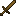 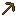 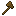 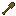 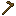 | Wooden    |   0   | `#!kotlin VanillaToolTiers.WOOD`      |
| 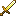 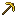 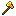 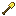 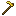 | Golden    |   0   | `#!kotlin VanillaToolTiers.GOLD`      |
|  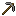 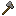 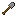 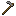 | Stone     |   1   | `#!kotlin VanillaToolTiers.STONE`     |
| 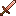 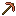 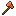 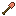 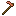 | Copper    |   1   | `#!kotlin VanillaToolTiers.COPPER`    |
| 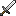 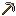 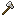 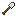 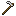 | Iron      |   2   | `#!kotlin VanillaToolTiers.IRON`      |
| 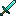 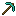 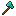 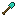 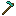 | Diamond   |   3   | `#!kotlin VanillaToolTiers.DIAMOND`   |
| 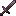 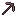 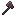 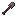 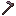 | Netherite |   3   | `#!kotlin VanillaToolTiers.NETHERITE` |

The numerical level values are assigned to the tool tiers in the `tool_levels.yml` config file:

```yaml title="tool_levels.yml"
wood: 0
gold: 0
stone: 1
iron: 2
diamond: 3
```

### Registering a custom tool tier

You can register a custom tool tier like this:

```kotlin
@Init(stage = InitStage.PRE_PACK) // (1)!
object ToolTiers {
    
    val EXAMPLE_TIER = ExampleAddon.registerToolTier("example_tier")
    
}
```

1. Nova will load this class during addon initialization, causing your tool levels to be registered.

Then, assign a numerical tool level value to your registered tier in the `tool_levels.yml` config file:

```yaml title="tool_levels.yml"
example_tier: 4
```

The specified level of `4` would give your custom tool the ability to break all blocks that `DIAMOND` or `NETHERITE` tools
could break and would also be able to break custom blocks that have a tool tier configured which resolves to a tool level of
`4`. This way, your tool can even break blocks that require a custom tool tier of another addon, as long as your
tool level is high enough.

## Tool Categories

Tool Categories define what type of tool your item is. They determine which blocks can be broken with which item.  
By default, there are six tool categories available:

| Tool Type                                                                                                                                                                                                                     |         | ToolCategory (Nova)                      |
|-------------------------------------------------------------------------------------------------------------------------------------------------------------------------------------------------------------------------------|---------|------------------------------------------|
|        | Sword   | `#!kotlin VanillaToolCategories.SWORD`   |
|        | Pickaxe | `#!kotlin VanillaToolCategories.PICKAXE` |
|        | Axe     | `#!kotlin VanillaToolCategories.AXE`     |
|        | Shovel  | `#!kotlin VanillaToolCategories.SHOVEL`  |
|        | Hoe     | `#!kotlin VanillaToolCategories.HOE`     |
| 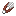                                                                                                                                                                                          | Shears  | `#!kotlin VanillaToolCategories.SHEARS`  |

### Registering a custom tool category

You can register a custom tool category like this:

```kotlin
@Init(stage = InitStage.PRE_PACK) // (1)!
object ToolCategories {
    
    val EXAMPLE_CATEGORY = ExampleAddon.registerToolCategory("example_category")
    
}
```

1. Nova will load this class during addon initialization, causing your tool categories to be registered.

You can then use your new tool category in the `Breakable` behavior of your custom block.
