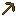
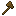
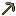
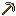

# Tools

## How do tools work?

Tools can be organized into a **tool category** (pickaxe , axe , ...) and a **tool tier** (wood , stone , ...).

Blocks are placed into one tag for the tool category and one tag for the minimum required tool tier:

- Tool Category: `#minecraft:mineable/pickaxe`, `#minecraft:mineable/axe`, ...
- Tool Tier: `#minecraft:needs_stone_tool`, `#minecraft:needs_iron_tool`, ...

So, for example, a diamond block is tagged with both `#minecraft:mineable/pickaxe`  and `#minecraft:needs_iron_tool` , requiring a pickaxe of at least the iron tier to break it.

Ultimately, whether a given item is the correct tool to mine a block is determined based on the rules defined in the [`minecraft:tool` data component](https://minecraft.wiki/w/Data_component_format#tool).

For example, these are the tool rules of an iron pickaxe:

```json
[
  { blocks: "#minecraft:incorrect_for_iron_tool", correct_for_drops: false }, // (1)!
  { blocks: "#minecraft:mineable/pickaxe", correct_for_drops: true, speed: 6.0 } // (2)!
]
```

1. The `#minecraft:incorrect_for_iron_tool` tag is an inversed tag that includes all `#minecraft:needs_X_tool` of higher tiers than iron. This rule matches all blocks that require at least a diamond tool to mine (i.e. all blocks that are in `#minecraft:needs_diamond_tool`) and disables drops for them.  
Since it is defined first, it overrules the `correct_for_drops` result of the second rule.
2. This rule sets the mining speed to `6.0` and enables drops for all blocks that are intended to be mined with a pickaxe. By itself, this rule would also allow drops for e.g. obsidian (which requires a diamond pickaxe to mine). However, this is prevented by the first rule, which excludes all blocks that require a higher tool tier. 

Not all tools follow this pattern. Swords, for example, do not differentiate between tool tiers, but instead have multiple different mining speeds for different blocks:

```json
[
  { blocks: "minecraft:cobweb", correct_for_drops: true, speed: 15.0 },
  { blocks: "#minecraft:sword_instantly_mines", speed: 3.4028235e38 },
  { blocks: "#minecraft:sword_efficient", speed: 1.5 }
]
```

## Tool Behavior

To create a custom tool in Nova, apply the `Tool` item behavior. You can decide whether you want to explicitly define the tool rules, or whether you want to define a `tool_category` and `tool_tier` which will automatically generate the tool rules for you, following the pattern described above. In each case, you'll need to make sure that the corresponding item and block tags exist.

=== "Explicit Tool Rules"

    === "Kotlin"

        ```kotlin 
        val EXAMPLE_ITEM = item("example_item") {
            behaviors(
                Tool(
                    toolRules = listOf(
                        Tool.Rule(blocks = BlockTypeTags.INCORRECT_FOR_IRON_TOOL, correctForDrops = false),
                        Tool.Rule(blocks = BlockTypeTags.MINEABLE_PICKAXE, correctForDrops = true, speed = 6f)
                    ),
                    itemDamageOnBreakBlock = 1,
                    defaultBreakSpeed = 1f, // (1)!
                    canBreakBlocksInCreative = true
                )
            )
            
            maxStackSize(1)
        }
        ```
    
        1. The default mining speed applied when no rule matches.

    === "Kotlin + YAML"

        ```kotlin 
        val EXAMPLE_ITEM = item("example_item") {
            behaviors(Tool())
            maxStackSize(1)
        }
        ```
    
        ```yaml title="configs/example_item.yml"
        tool_rules:
          - blocks: "#minecraft:incorrect_for_iron_tool"
            correct_for_drops: false
          - blocks: "#minecraft:mineable/pickaxe"
            correct_for_drops: true
            speed: 6.0
        item_damage_on_break_block: 1
        default_break_speed: 1.0
        can_break_blocks_in_creative: true
        ```

=== "Inferred Tool Rules"

    === "Kotlin"
    
        ```kotlin 
        val EXAMPLE_ITEM = item("example_item") {
            behaviors(
                Tool(
                    toolTier = Key.key("wooden"), // (1)!
                    toolCategories = setOf(Key.key("pickaxe")), // (2)!
                    breakSpeed = 15f, // (3)!
                    itemDamageOnBreakBlock = 1,
                    canBreakBlocksInCreative = true 
                )
            )
            
            maxStackSize(1)
        }
        ```
    
        1. Used to infer the `<namespace>:incorrect_for_<tool_tier>_tool` tag for the tool rules.
        2. Used to infer the `<namespace>:mineable/<tool_category>` tag(s) for the tool rules.
        3. The break speed applied when the tool category matches. The tier separately determines whether the tool is correct for drops. For a more fine-grained control you'll need to define the tool rules explicitly.
    
    === "Kotlin + YAML"
    
        ```kotlin
        val EXAMPLE_ITEM = item("example_item") {
            behaviors(Tool())
            maxStackSize(1)
        }
        ```
        
        ```yaml title="configs/example_item.yml"
        # The tool tier
        tool_tier: minecraft:iron
        # The tool category
        tool_category: minecraft:sword
        # The block breaking speed
        break_speed: 1.5
        # If this tool can break blocks in creative
        can_break_blocks_in_creative: false
        ```

## Custom Tool Categories and Tiers

Since tool logic is completely based on rules that operate on block tags, the only thing you need to do to create a custom tool tier or category is to create and use the corresponding tags.

=== "Explicit Tool Rules"

    ```kotlin
    val BLACKSTONE_DRILL = ExampleAddon.item("blackstone_drill") {
        behaviors(Tool(toolRules = listOf(
            Tool.Rule(blocks = INCORRECT_FOR_BLACKSTONE_TOOL, correctForDrops = false),
            Tool.Rule(blocks = MINEABLE_DRILL, correctForDrops = true, speed = 6f)
        )))
        
        maxStackSize(1)
    }
    
    // -- Item Tags --
    val DRILLS = ExampleAddon.itemTag("drills") {
        add(BLACKSTONE_DRILL)
    } // (2)!

    // -- Block Tags --
    val INCORRECT_FOR_BLACKSTONE_TOOL = ExampleAddon.blockTag("incorrect_for_blackstone_tool") {
        add(BlockTypeTags.INCORRECT_FOR_IRON_TOOL) // (1)!
    }
    val MINEABLE_DRILL = ExampleAddon.blockTag("mineable/drill") {}
    ```

    1. For example, make the new blackstone tier equivalent to iron.
    2. While not required, it is convention to also create a tag containing all items of a given tool category. For example, Minecraft also has `#minecraft:pickaxes` and `#minecraft:axes` tags.

=== "Inferred Tool Rules"

    ```kotlin
    val BLACKSTONE_DRILL = ExampleAddon.item("blackstone_drill") {
        behaviors(Tool(
            toolTier = Key.key(ExampleAddon, "blackstone"),
            toolCategories = setOf(Key.key(ExampleAddon, "drill")),
            breakSpeed = 6f
        ))
        
        maxStackSize(1)
    }
    
    // -- Item Tags --
    val DRILLS = ExampleAddon.itemTag("drills") {} // (2)!

    // -- Block Tags --
    val INCORRECT_FOR_BLACKSTONE_TOOL = ExampleAddon.blockTag("incorrect_for_blackstone_tool") {
        add(BlockTypeTags.INCORRECT_FOR_IRON_TOOL) // (1)!
    }
    val MINEABLE_DRILL = ExampleAddon.blockTag("mineable/drill") {}
    ```
    
    1. For example, make the new blackstone tier equivalent to iron.
    2. When using the inferred tool rules approach, the `Tool` behavior also adds the item to this tag automatically. This means that the `#example_addon:drills` tag **must** exist, unlike when using the explicit tool rules approach.
