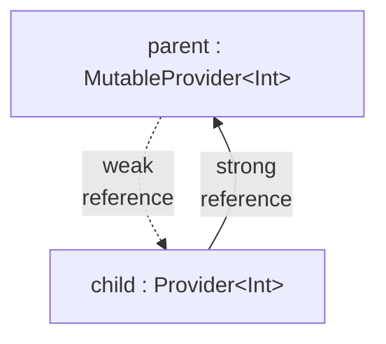
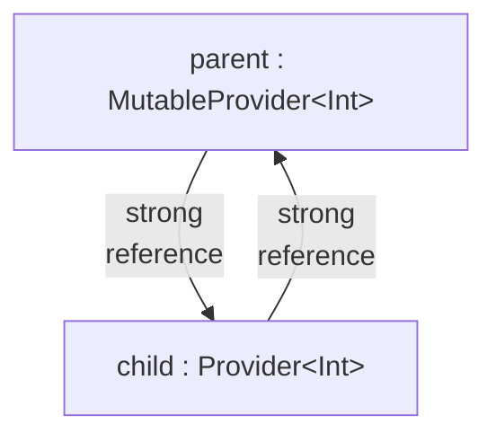

# Providers

## What are Providers?

If you've written a Gradle plugin before, the concept of Nova's `#!kotlin Provider<T>` and `#!kotlin MutableProvider<T>` will feel quite familiar to you, as they are similar to Gradle's `#!kotlin Provider<T>` and `#!kotlin Property<T>`.

A `#!kotlin Provider<T>` is a thread-safe container for a single, lazily-initialized value. You can create a very simple `#!kotlin Provider<T>` like this:

```kotlin
val myProvider: Provider<Int> = provider { 
    println("Initializing...")
    0
}
```

and then resolve its value via `#!kotlin Provider.get()`:

```kotlin
println(myProvider.get()) // prints "Initializing...", then "0"
```

Providers can be used to model lazy reactive data transformations:

```kotlin
val parent: MutableProvider<Int> = mutableProvider(1)
val child: Provider<Int> = parent.map { it * 2 }
println(child.get()) // 2
parent.set(2)
println(child.get()) // 4
```

You can also delegate a property to a provider. This can be useful for [config-reloadable](configs.md) properties.

```kotlin
val myProperty: Int by myProvider // automatically up-to-date after reloading configs
```

## Fundamental Provider Functions

For `Provider`, the three fundamental transformation functions are:

- `#!kotlin Provider.map { ... }`: Transform `#!kotlin Provider<A>` to `#!kotlin Provider<B>`
- `#!kotlin Provider.flatMap { ... }`: Transform `A` to `Provider<B>`, but instead of `#!kotlin Provider<Provider<B>>`, give me a flat `#!kotlin Provider<B>`
- `#!kotlin combinedProvider(...)`: Combine `#!kotlin Provider<A>`, `#!kotlin Provider<B>`, ... to a single result `#!kotlin Provider<R>`

With `MutableProvider`, you can also:

- `#!kotlin MutableProvider.map({ ... }, { ... })`: Bi-directionally transform between `#!kotlin MutableProvider<A>` and `#!kotlin MutableProvider<B>`
- `#!kotlin MutableProvider.decompose({ ... }, { ... })`: Bi-directionally combine and take apart a value into multiple providers

There are many other transformation functions available, but they are mostly just syntax sugar that calls one of the these fundamental functions. Refer to the [commons-provider KDocs](https://commons-provider.dokka.xenondevs.xyz) for a full reference and additional details.

## Weak Reference Semantics

Using the following example, we've constructed a provider graph like this:

<div class="grid codeblock-and-diagram" markdown>
```kotlin
val parent: MutableProvider<Int> =
    mutableProvider { 0 }

val child: Provider<Int> =
    parent.map { it * 2 }
```


</div>

By default, parents reference their children [weakly](https://docs.oracle.com/en/java/javase/25/docs/api/java.base/java/lang/ref/WeakReference.html). This design allows you to have global top-level providers (for example for values of configs) and use them for shorter-lived objects without introducing memory leaks:

```kotlin
val PARENT: MutableProvider<Int> = mutableProvider { 0 }

fun foo() {
    val child: Provider<Int> = PARENT.map { it * 2 } // (1)!
}
```

1. If `PARENT` were to reference `child` strongly `child` would be kept in memory indefinitely, creating a memory leak. Instead, `child` is referenced only weakly so it can be garbage-collected after `foo()`.

You can also enforce strong child references by using the transformation functions prefixed with `strong`:

<div class="grid codeblock-and-diagram" markdown>
```kotlin
val parent: MutableProvider<Int> =
    mutableProvider { 0 }

val child: Provider<Int> =
    parent.strongMap { it * 2 }
```


</div>


!!! bug "Avoid `#!kotlin Provider.subscribe` and `#!kotlin Provider.observe`, if possible!"
    
    Due to the aforementioned weak reference semantics, it is recommended to avoid using `#!kotlin Provider.subscribe` or `#!kotlin Provider.observe`, if possible. If you do need to use it, you'll need to make sure that you either:

    - store the provider that you subscribed to in a field (preferred, as it is simpler to reason about) or
    - that the entire provider chain used transformations with strong reference semantics like `#!kotlin Provider.strongMap { }`

    Otherwise, your subscription may suddenly stop working as the `Provider` you subscribed to was garbage-collected.

## Usage of Providers in Nova

Providers serve several use-cases in Nova:

- They are used as lazy values with convenient transformation functions. For example, when you register a custom item type, you'll get a `#!kotlin RegistryEntry<ItemType>`, which is also a `#!kotlin Provider<ItemType>`. This is because the actual `ItemType` has not yet been created, but you may still want to wire it somewhere (for example set it as the item type of a custom `BlockType`). Providers help with this as you'll need to think less about initialization order or fight with circular dependencies. *(If you are familiar with Minecraft's internals, think: `#!kotlin Holder.Reference<*>`)*
- They facilitate reloading mechanisms such as:
    - **config reloading**: For example, you can have the data components of your custom item type depend on a value in a config. The [config system](configs.md) gives you a provider, which you can transform to a data component and return in your [item behavior](items/item-behaviors.md).
    - **registry reloading**: [Registries](registries.md) can be reloaded to change their elements or tags. Both `#!kotlin RegistryEntry<*>` and `#!kotlin RegistryEntrySet<*>` are providers and support reactive transformation functions. For example, you can transform a `#!kotlin RegistryEntry<GuiTexture>` to a `#!kotlin Provider<Component>` and wire it to the title of an [InvUI Window](../../../invui/window/). Then, when the [gui texture](guis/guitextures.md) registry is reloaded, the title updated appropriately.
- They manage state in [InvUI's reactive API](../../../invui/reactive-menus/). Since it's all using the same API, you can easily make your InvUI GUIs support things like config- and registry reloading.
- They're used to lazily transform [tile entity](blocks/tile-entities.md) data after deserialization and before serialization.
