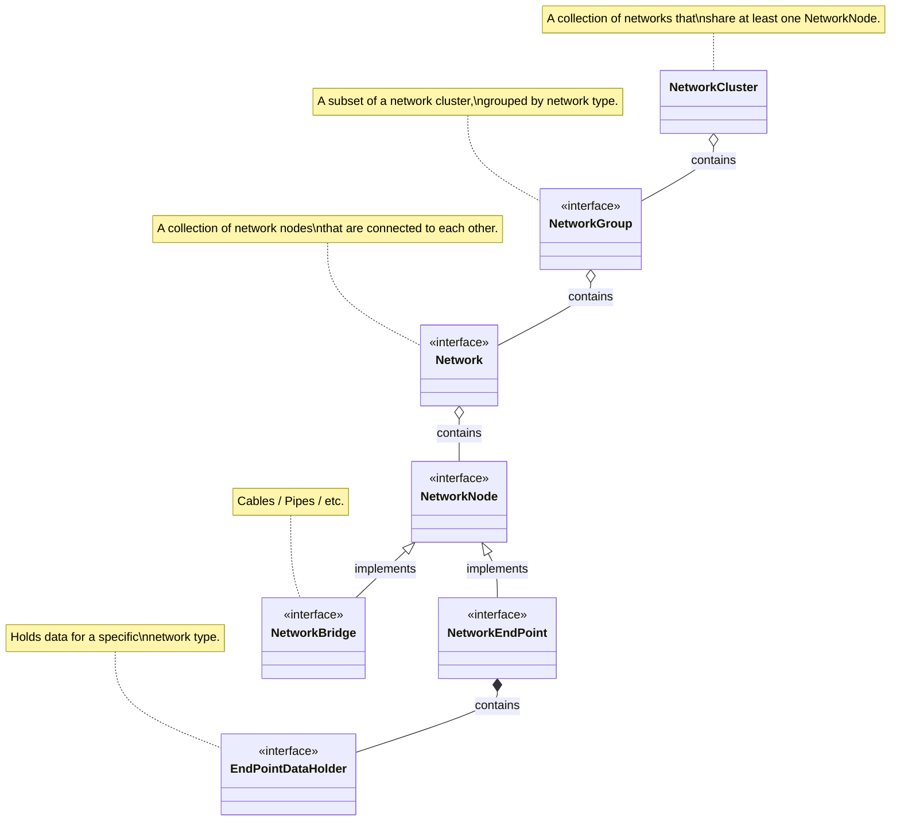
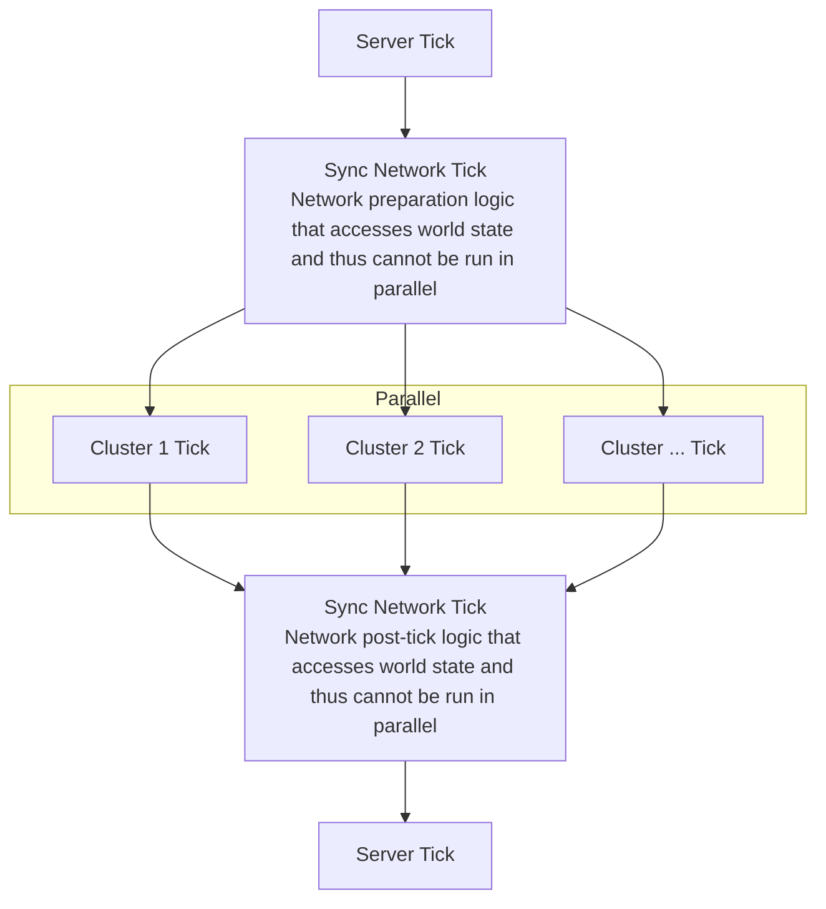

# Tile Entity Networks - Introduction

## Overview

The following diagram is intended to give a quick overview on how Nova's network system works.  
For more detailed information, check out the KDocs.



In most cases, you won't need to worry about the network system and will just inherit
from [NetworkedTileEntity](networked-tile-entity.md) to make your tile-entity network compatible.

??? tip "Visualization: Networks vs. Network Clusters"

    **(Item-)Networks** `/nova debug showNetwork nova:item`:  
    The particles visualize what network a block belongs to.
    As you can see, each cable section is a different network and every chest is part of two networks.

    

    **Network Clusters** `/nova debug showNetworkClusters`:  
    The particles visualize what network cluster a block belongs to.
    Since the four left networks all share chests, and the four right networks all share chests, there are only
    two network clusters.

    

## Network Tick

Most of the tick logic of networks is run in parallel with networks from other clusters:



Because network tick logic is run in parallel, it is imperative that networks do not modify the world state
(apart from the data stored in the NetworkNodes themselves), which also requires update handlers (for example for
inventories or fluid containers) to behave in the same way.

## Default network types

By default, Nova ships with 3 network types: `nova:energy`, `nova:item` and `nova:fluid`.

| Id            | EndPointDataHolder type | Description                            |
|---------------|-------------------------|----------------------------------------|
| `nova:energy` | `EnergyHolder`          | Distributes energy between end points. |
| `nova:item`   | `ItemHolder`            | Distributes items between end points.  |
| `nova:fluid`  | `FluidHolder`           | Distributes fluids between end points. |

## (Un-)registering NetworkNodes

To register/unregister `NetworkNodes`, queue a network task using `NetworkManager`:

```kotlin
NetworkManager.queueAddEndPoint(endPoint) // registers an end point
NetworkManager.queueAddBridge(bridge, supportedNetworkTypes) // registers a bridge

NetworkManager.queueRemoveEndPoint(endPoint) // unregisters an end point
NetworkManager.queueRemoveBridge(bridge) // unregisters a bridge
```

You'll need to add `NetworkNodes` after they've been placed and also remove them when they're destroyed.
You don't need to add/remove on chunk (un-)load.

If you're using [NetworkedTileEntity](networked-tile-entity.md), this will be done for you.

## Interacting with NetworkState (advanced)

To interact with any network-related data (for example `connectionConfig` of `ItemHolder`),
you need to queue a network task using `NetworkManager` to prevent concurrency issues.  
Here, you'll also obtain an instance of `NetworkState`, which gives you access to all network-related data
of the given chunk's world.
For more information, check out the KDocs.

```kotlin
NetworkManager.queueRead(chunkPos) { state: NetworkState ->
    // code that only reads from state
}

NetworkManager.queueWrite(chunkPos) { state: NetworkState ->
    // code that writes to state
}

NetworkManager.queue(chunkPos) { state: NetworkState ->
    var hasWritten = false
    // code that may write to state
    return@queue hasWritten
}
```

After a network task that writes to the state was executed, dirty networks will be rebuilt.